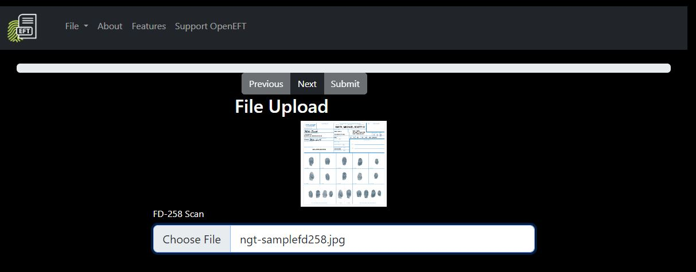
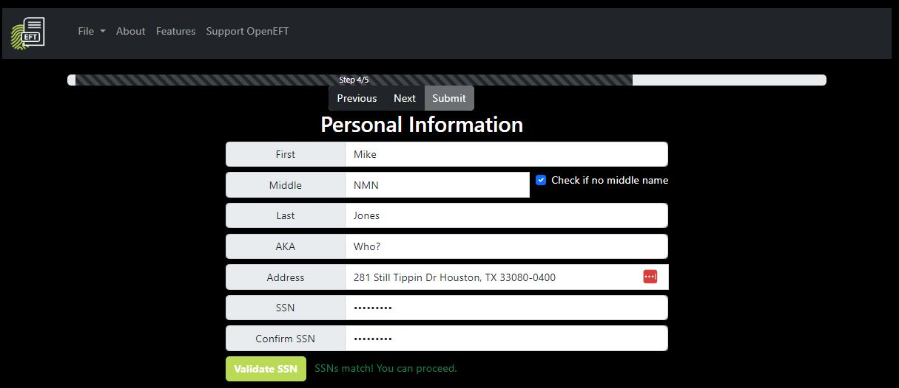
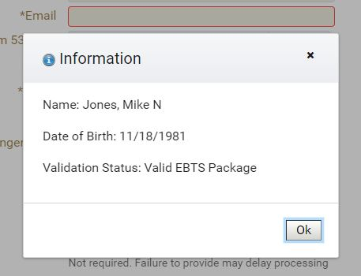
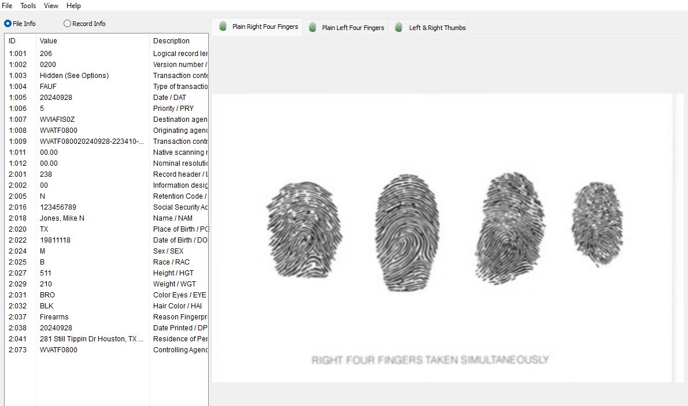

# OpenEFT


If you're here, you probably need to file a Form 1 or Form 4 and would like to use your electronic fingerprints! Welcome to the future, old man.

OpenEFT is an open-source project originally created by Noah Wood. Its purpose is to convert physical FD-258 fingerprint cards to EBTS-packaged, EFT-formatted files.

### Why the heck is there another version of this?

Well, the original software appears to be abandoned (the dev's Reddit account was deleted and the code is not being maintained). It also had a few core issues, including links to independently-maintained codebases (such as NIST's NBIS) and the use of older libraries. This project aims to make the installation process easier, provide a more seamless user experience, and extend the software lifecycle.

## How To Use

1. Print an FD-258 card (use <a href=fd-258-110120.pdf>this file</a> for a fillable card)

2. Roll your prints on the card (you don't need to fill out the boxes)
- - **There is no need to fill out your personally identifiable information**
  - **EForms only recognizes slaps and thumbs, so there is no need to roll your 10prints on this branch**

3. Take a high-resolution **1:1** scan (at least 600 DPI) of the completed FD-258 card.

4. After following the install instructions below, run the Python program from the command line like so:

   ```
      cd ~/OpenEFT
      source ~/.bashrc
      python3 openeft.py
   ```

   (Press CTRL+C to exit the program at any time)

5. Access the tool via http://localhost:8080

6. Click "Start New EFT" and follow the instructions on each corresponding train stop.

7. Validate the generated file using <a href="https://www.netxsolutions.co.uk/NISTViewer.aspx" target="_blank">NIST Viewer</a>

8. Validate the file was packaged correctly to EBTS specifications by attempting to upload it to the Responsible Person train stop of eForms

9. Congratulations! You now have an EFT!


## Installing

1. If you haven't already installed WSL, <a href="https://learn.microsoft.com/en-us/windows/wsl/install" target="_blank">follow these instructions</a>
2. Enter a WSL session by clicking `Start > Run > powershell.exe` and typing the command `WSL` (press enter afterward)
3. Clone the repo:

   ```sh
   git clone --recurse-submodules https://github.com/Robbbbbbbbb/OpenEFT.git
   ```

4. Build & Install

#### If Windows

   ```sh   
   cd OpenEFT
   ./build_windows.sh
   ```
*Not working?* Did you remember to enter a WSL session like in Step 2?

#### if Docker (in Windows)

Automated pull using dockercli: `docker pull robbstumpf/openeft`

Manual pull:
Save Dockerfile to `Downloads` folder
Ensure Docker Desktop is running
Open `CMD` and navigate to `%userprofile%\Downloads`
Run the following command to build the Docker image

```sh
docker build -t openeft-0.4.0 .
```
Note that 0.4.0 is the version when this guide was published. You can name it `openeft` if you don't care about versioning.

Run the Docker image and expose it to TCP/8080:

```sh
docker run -p 8080:8080 openeft-0.4.0
```

#### If Linux

   ```sh
   cd OpenEFT
   ./build_linux.sh
   ```

5. Run the program!

   ```bash
   python3 openeft.py

6. Access the app in a web browser:

   http://localhost:8080

   **NOTE**: If you want to access this on other hosts on your network, <a href="https://archive.is/1GBWH" target="_blank">you can open TCP/8080 on Windows Firewall</a>. Since OpenEFT does not run as root, it cannot bind to a port below TCP/1024 (eg: no 80/443)
   
   **NOTE**: If placing behind a reverse proxy, do _not_ expose this to the internet unless you want the world to have your EFTs and be able to read the contents (eg: your SSN)

## Requirements

#### Operating Systems

* Windows using WSL (https://learn.microsoft.com/en-us/windows/wsl/install) - Tested, working
* Docker - Tested, working
* Linux (Ubuntu) - **Untested** - Docker is working using the `./build_linux.sh` script, so assuming you have the dependencies installed, you should be golden.

## Tips

#### How To Record Fingerprints

If you've never had your fingerprints taken, you definitely need to know how to do it. The first ten prints should be "rolled" on as the video demonstrates, then you need to take two "slap" impressions of the four fingers on each hand and two flat impressions of the thumbs.

[](//www.youtube.com/watch?v=47YLGj_yLVA "Fingerprinting Technique")


#### External Libraries

* [NBIS](https://www.nist.gov/services-resources/software/nist-biometric-image-software-nbis) (Currently a working build is forked to https://github.com/Robbbbbbbbb/NBIS.git and is called with the ./build_windows.sh script)

#### Python Modules

* [OpenCV-Python](https://github.com/opencv/opencv-python)
* [Imutils](https://github.com/PyImageSearch/imutils)
* [Pillow](https://python-pillow.org/)
* [NumPy](https:://numpy.org)
* django

## ScreenShots

)









